# Restaurant-Recommendation-System--Binary-Dragonfly-Algorithm
 Group Recommendation System using Intelligent Collaborative Filtering using Binary Dragonfly Algorithm as a Neighbor Searching algorithm
A Group Recommedation System for recommending the restaurants to a group of users based on their tastes and preferences in terms of Eating and drinking,smoking habits.
Finding a perfect restaurant from a list of restaurants has always been a challenge for the people, and also remember people go to restaurants in groups either with family or their friends so finding a restaurant that satisfies the preferences of all the members upto an extent is what the aim of this project is.

The main objective of this project is to achieve minimum sparsity and optimal neighbor selection for the efficient results. The research illustrates how optimal groups could be formed from the available information. To accomplish this task, intelligently discards redundant qualities from the substantial arrangement of characteristics and uses the significant attributes to frame the gatherings. The proposed filtering is optimized with the help of Binary Dragonfly Algorithm.The optimizer reduces the sparsity problem and minimizes the number of neighbors required to be compared for the similarity. Therefore, the retrieval time of the identification of neighbors is minimized and a time-efficient group recommendation framework is obtained.
 
 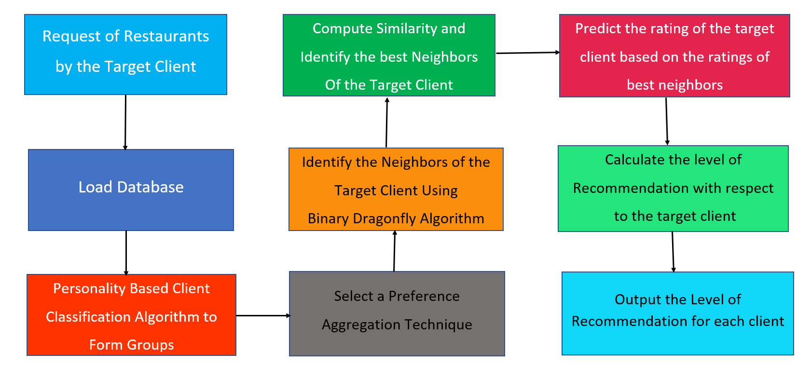 
 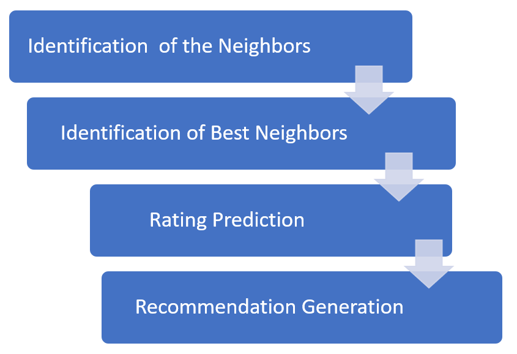
 
 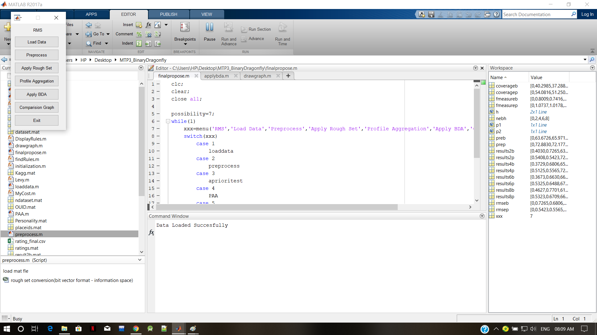
 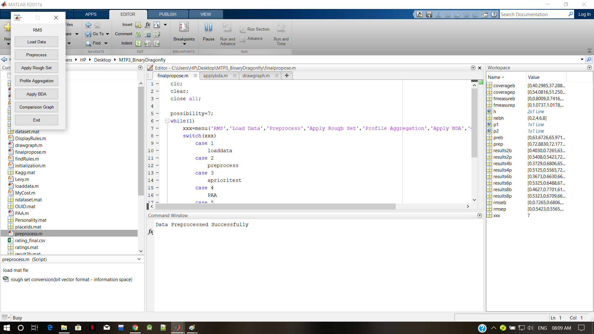
 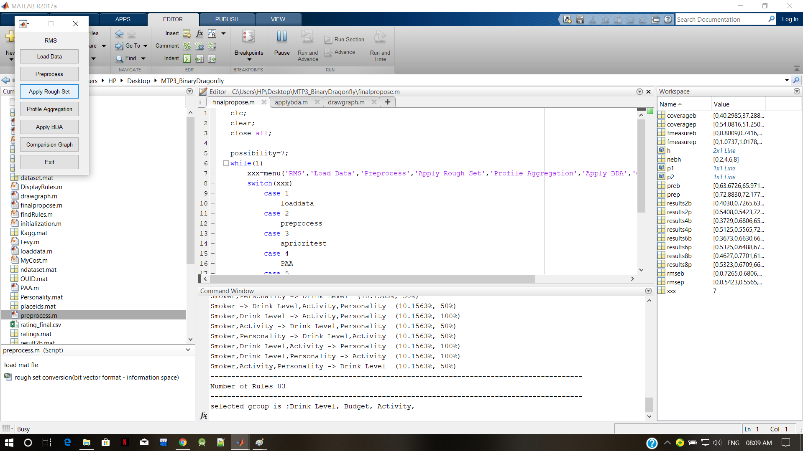
 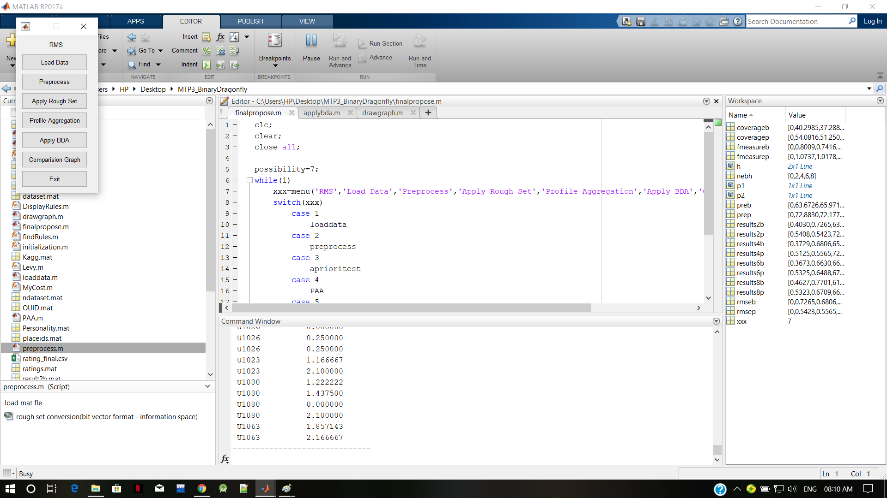
 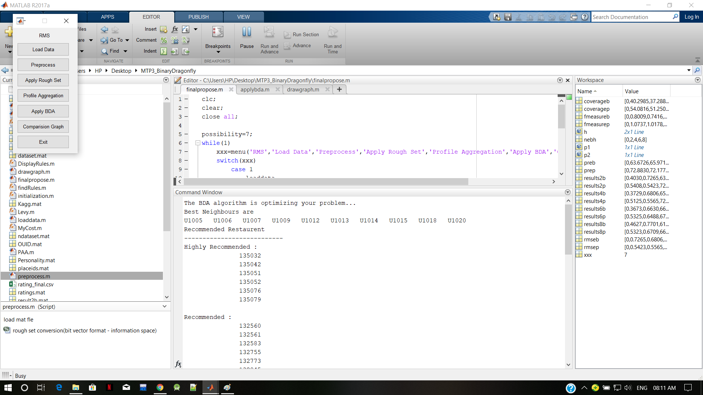
 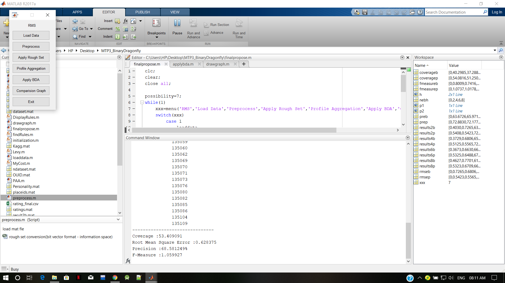
  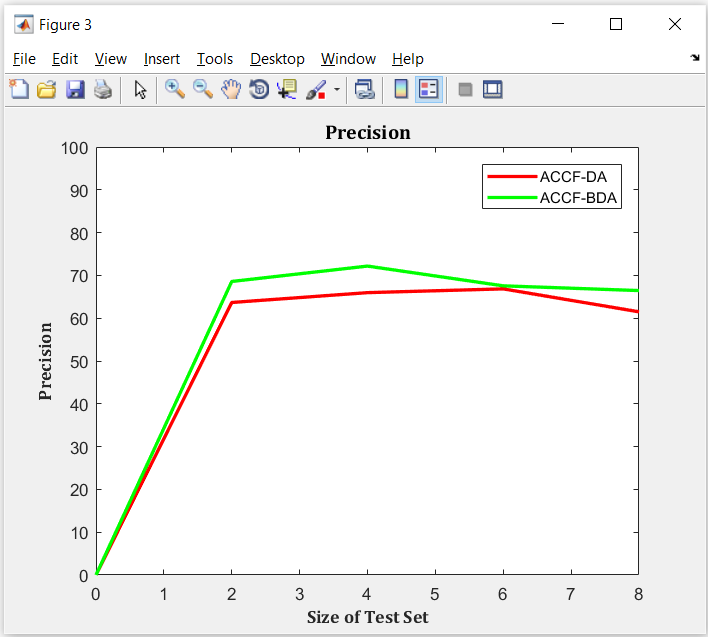 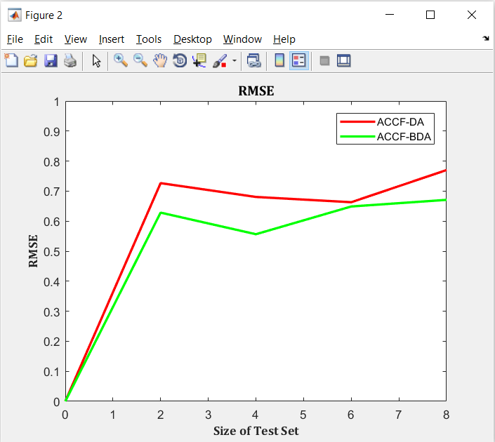
  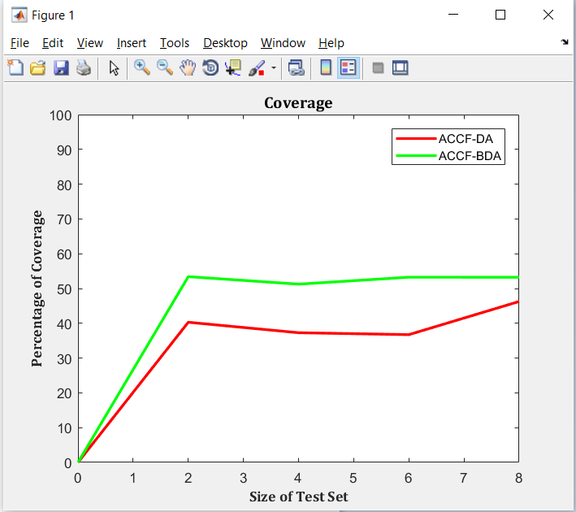 
